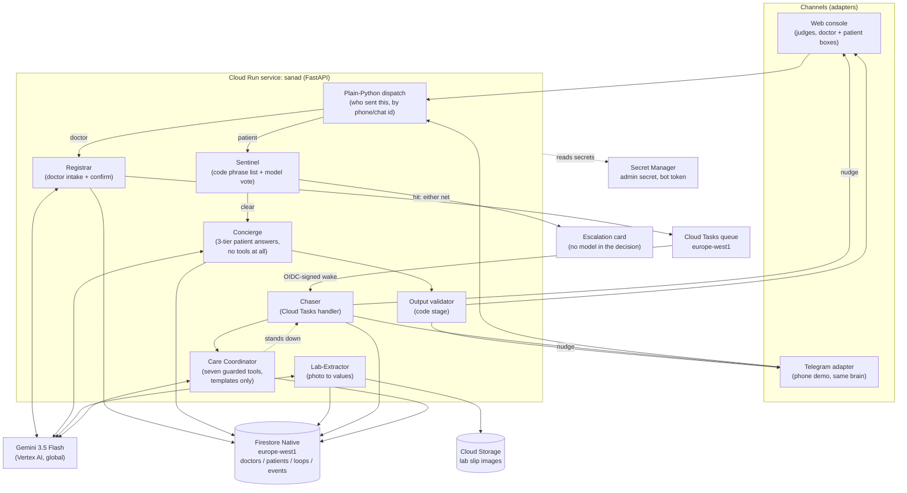

# Sanad

**Sanad** is Arabic for "the one you lean on." It is an AI agent that sits on a doctor's number and owns the part of care that currently falls through the cracks: everything that happens between one visit and the next.

**The doctor gives the plan once. Sanad carries it until reality matches.**

A hybrid autonomous care-loop system: Gemini agents understand people, evidence and barriers; a deterministic safety kernel controls clinical boundaries; durable cloud infrastructure carries the objective across time.

Every patient in this repository and in the demo is invented; do not enter real patient data.

## The problem this comes from

A doctor sees a patient, gives instructions, and the visit ends. What happens next is usually silence. The patient does not come back for the follow-up test. He forgets when to take the new medication, or stops it without saying so. Then, days or weeks later, he messages the doctor directly, at any hour, often in a panic, because the plan was never written down anywhere he could return to and nobody was chasing the loose ends on his behalf. The doctor either drops everything to answer, or the message sits unread. Neither is sustainable across a full patient panel, and both are worse for the patient.

Sanad exists to close that gap. The doctor dictates his instructions after a visit, the way he already talks: "get a lipid panel from Ahmed in two weeks, start him on atorvastatin, check blood pressure daily for a week." Sanad turns that into a structured record and a set of care loops, confirms it with the doctor in one tap, and then owns those loops: it messages the patient at the right time, reads lab photos, answers the patient's questions strictly from the doctor's own plan, and escalates immediately if anything looks dangerous. The doctor sees a report, not a stream of raw messages. **The doctor becomes the exception handler, not the project manager.**

## Who talks to what

- **The doctor** works from a web dashboard (dictate, board, review cards). When
  a Telegram bot and doctor chat are configured, red and yellow cards also fan
  out to that phone and doctor messages can enter through Telegram.
- **The patient** is on Telegram. Confirming a record produces a one-time deep
  link and a QR of the same link, printed on the prescription or held up on
  screen; one tap binds that chat to that record for good, the conversation
  lives in an app he already has, and Sanad can message him first. That last
  part is the whole reason it is a messaging app and not a web page: a web page
  cannot notify anyone and cannot be found again three weeks later.
- **The patient page** (`/p/<link token>`) is the same conversation in a
  browser, for a judge who does not want to install Telegram. It is a fallback,
  not the product.
- **WhatsApp** is a planned product channel and is not in this repository. The
  outbound boundary is channel-agnostic behind a send-only `ChannelAdapter`;
  implementing and approving a WhatsApp adapter remains future work.

## What Sanad is not

It is not a diagnosis tool, it does not decide on dose changes, and it does not replace the doctor's judgment. Every clinical instruction a patient receives traces back to something the doctor wrote. Sanad's job is to remember, to chase, to read, and to know when to wake the doctor up. Nothing more.

### Privacy, and what this demo does with what you type

> This is a hackathon demo. Do not enter a real patient's name, phone number, diagnosis, photo or message into it. Text and records are stored in Firestore; uploaded images are stored in the private Cloud Storage bucket, both in `europe-west1`; and relevant content is sent to Gemini through Vertex AI for transcription, extraction and replies. Project administrators and Google Cloud services operating the project may process that data. This repository has no automated teardown or retention job: delete the project resources yourself when the demo ends. Sanad is not a medical device and its replies are not medical advice.

---

## Architecture

One Cloud Run service (FastAPI, Python 3.12, ADK 2.8.0) is the entire agent core. It talks to Gemini `gemini-3.5-flash` over Vertex AI, stores records in Firestore and images in Cloud Storage, and wakes itself on a schedule through Cloud Tasks. ADK sessions are created per turn rather than reused; durable application records and delivery ledgers live outside the process.



### Why it is built this way

- **Stateless ADK turns, durable records.** Each agent request builds a fresh ADK `Runner` and in-memory session, uses it once and discards it. Firestore holds records and delivery ledgers, Cloud Storage holds images, and Cloud Tasks holds scheduled wakes. The race and idempotency suites exercise restart-safe claims locally. `app/core/registrar.py` shows the per-turn Runner directly.
- **Three agents, and their toolsets are disjoint.** Not six. The **Registrar** turns a dictation into a proposed record and holds no tools; the **Care Coordinator** owns one care obligation and holds seven, every one of them guarded in code before it runs; the **Concierge** answers patients and holds none at all. Sender identity is resolved in plain code. The Concierge cannot write or call a tool; separately, code-matched patient replies and evidence may invoke the Coordinator's guarded state changes. One caveat, which `docs/ARCHITECTURE.md` states in full: a photographed prescription is read by a direct `google.genai` call with the same schema rather than by the ADK Registrar. "Three agents" describes tool surfaces rather than every model request.
- **The Coordinator has tools but no words.** It chooses one action from a fixed list of seven and stops: schedule the next contact, ask for the missing part of a result, classify a barrier, escalate a barrier, mark evidence received, close a loop the doctor has already reviewed, pause the reminders. Every call is put to `core/policy.py` first, in code, against the doctor's own window and limits, and a refusal comes back to the model as a reason it can choose again inside. What the patient then hears is one of eight templates, gendered and in his own language, with a date, a name or an analyte as the only variable parts: there is no path from the agent to a sentence it wrote itself. There is no tool for cancelling an escalation, changing a dose or editing the plan, so those are not refusals, they are absences. An escalated barrier is not a notice: the card carries an Answer button, and the doctor's reply reaches the patient, joins the plan, takes the obligation off hold and puts the next contact back on the queue. If the model errors or times out, the fixed S3 ladder runs exactly as it did and the audit line says `fallback: ladder (model unavailable)`; if it simply has nothing to do, which is the right answer to an ordinary question, it stands down and the Concierge answers.
- **Six administrative chores are matched in code before the administrative model vote.** "I did the test", "I lost the prescription", "can I come Thursday instead", "where do I send it", "the medicine is not available", "I forgot to measure": a pattern list in Egyptian Arabic, English and Franco-Arabic runs after the Sentinel and treatment-change gates. One bounded vote may add only either of the two answer-only matches. The four that change the plan of work require a code pattern and go through the Coordinator's guarded tools (`core/intents.py`).
- **Sentinel and the output validator as code stages, not agents.** Whether a message is a medical emergency, and whether a generated reply is safe to send, are both decided by code that runs before and after the model call, not by prompt instructions the model could be talked out of. Three of those stages also ask the model for one yes/no vote (triage, treatment change, reassurance), and each of those votes can only ADD a relay or an escalation and fails closed, so a model that is wrong or unreachable can cost the doctor a card he did not need and can never cost a patient a gate. See `docs/SAFETY.md` for the full mechanism.
- **Cloud Tasks wakes the agent.** A care loop with a due date does not need a doctor or a patient present to make progress. When a loop is committed, its nudges are scheduled as Cloud Tasks with future run times, in the same region as everything else. The task handler is the same code path a doctor's manual `/force_due` command hits, so the demo can compress days into seconds honestly, showing the real handler on a short timer rather than a separate demo-only code path.
- **Two-state review gate.** A loop that receives evidence (a lab photo, a monitoring value) never marks itself finished. It moves to "pending doctor review," and only an explicit doctor action closes it or sends a note back to the patient. Sanad files and flags; it does not sign off on its own findings.
- **3-tier answer fence.** Every patient message is answered in a fixed order enforced by code: the blood-pressure table first for a message that is nothing but a reading, then the Sentinel (which can only escalate, never answer), then the treatment-change gate, then the doctor's written plan (the only source for plan-specific answers), then general education under rails, with anything about changing treatment relayed to the doctor instead of answered. The change gate runs before the photo branch, so a caption under a photo is gated exactly like typed text. See `docs/SAFETY.md`.
- **Deterministic where it matters, model where it helps.** Routing, emergency phrase and critical-lab tables, date arithmetic, reply validation, reports and idempotency are code. Models transcribe, extract structured candidates, cast bounded add-only votes and phrase patient replies. Code validates the structured patient and reply paths; completion reports are assembled from stored facts without a model-written flag. `app/core/validator.py` enforces number and medication provenance on generated patient replies. Text the doctor wrote himself is the trusted path and goes to the patient as his.

### Request lifecycle, in brief (full detail in `docs/ARCHITECTURE.md`)

- **Patient message:** reject text above 1,000 characters without a model call → take a per-patient Firestore turn lease → load patient + plan + last events → blood-pressure table → Sentinel → treatment-change gate → consent and third-party gates → administrative tier → Care Coordinator, when an obligation applies → Concierge → output validator → reassurance vote → send. A code-net emergency bypasses an ordinary in-flight lease rather than waiting behind it. A bare blood-pressure reading exits in code: a red value follows the emergency path, while a non-red value is filed under an open monitoring loop and receives a fixed acknowledgement. A Sentinel model hit escalates, while a triage error relays the message unanswered. A voice note is transcribed before its transcript enters the same gates; decoded digital silence is refused before transcription, and the resulting transcript is checked against the same length limit.
- **Doctor dictation:** text or voice → transcribe if needed → Registrar extracts a structured record and loop proposals → code validates the shape (loop types, required fields, real dates) → the identification step reads the dictation against the doctor's own board → confirm card → doctor taps confirm → Firestore write + Cloud Tasks scheduled for any loop with a due date. A dictation about a patient already on the board attaches to that patient, adding the new loops and appending the new instructions to his plan as a dated addendum rather than replacing it; a shared first name, a description with no name in it, or anything the code name matcher and the model do not agree on asks which one, with a button per candidate, and writes nothing until the doctor taps. If one dictation names another known patient, or the structured extraction reports another name that code can trace to the source text, the confirm card warns that only the primary record will be registered and tells the doctor to dictate the other instructions separately.
- **Scheduled chase:** Cloud Tasks fires the Chaser handler on an OIDC-signed identity → checks the demo run id, whether the loop is paused, quiet hours, the one-message-a-day rule, the doctor's own contact limits, and the idempotency key → wakes the Care Coordinator, which decides what this wake-up is for → sends the nudge in the patient's language → records the attempt. Three unanswered nudges move the loop to "unreachable" instead of retrying forever.
- **A care obligation over time:** every open loop is a Care Contract (objective, evidence required, permitted actions, one fixed safety sentence, deadline, escalation conditions), shown on the confirm card the doctor taps and on the patient's page from the same function. A wake-up, a patient reply, evidence arriving, or silence past a deadline wakes the Coordinator for that contract; it chooses one guarded tool and the reason is written to the log and printed on the card.
- **Patient photograph:** exact image bytes are claimed in Firestore by patient and Cairo day before storage or extraction. A repeated copy is acknowledged from a fixed template, written to the feed and counted in the daily summary, without creating a second result, card or model call. An identity-mismatched slip still exposes its values to the doctor (and remains red for a critical value), but code suppresses ordered-test completeness and every Attach action.

### The honest model-call count

A bare blood-pressure reading and a message the code Sentinel catches cost no model call. An ordinary patient question costs up to six: the Sentinel vote, treatment-change vote, administrative vote, Coordinator, Concierge and reassurance vote. A voice note adds transcription. A photographed slip costs one read, with a second read when orientation requires it, and an unsatisfied contract can add a Coordinator call. A scheduled wake costs one. A typed dictation normally costs extraction plus identification; voice adds transcription. A completion report costs no model call. The full table is in `docs/ARCHITECTURE.md`.

---

## Setup and deployment

The commands below are for a new, disposable Google Cloud project. `deploy.sh`
reuses named resources when they already exist, but each deployment may create a
new Cloud Run revision.

### Prerequisites

- A Google Cloud project with billing linked. Creating a project and linking its
  billing account are organization-specific and are not automated here.
- An operator allowed to enable services, create and bind service accounts,
  create Firestore, Storage, Tasks and Secret Manager resources, and deploy a
  public Cloud Run service. Project Owner on a disposable demo project is the
  simplest setup; use narrower roles if your organization requires them.
- `gcloud`, Bash, `curl`, OpenSSL, `grep`, `sed`, `tr` and `jq` installed.
- Python 3.12 for the local test command. ffmpeg is needed for local voice work;
  the container installs it itself.
- Acceptance of `europe-west1` before the first Firestore command. Firestore's
  default-database location is a one-way choice. Change `REGION` consistently in
  code and deployment before creating resources if that location is unsuitable.

Authenticate and select the project. `deploy.sh` reads the project from
`gcloud config`; set `PROJECT` to override.

```bash
gcloud auth login
gcloud config set project <YOUR_PROJECT_ID>
export PROJECT="$(gcloud config get-value project)"
test -n "$PROJECT" && test "$PROJECT" != "(unset)"
```

Enable every API used by the script or runtime before the first deploy:

```bash
gcloud services enable \
  run.googleapis.com cloudbuild.googleapis.com artifactregistry.googleapis.com \
  firestore.googleapis.com aiplatform.googleapis.com secretmanager.googleapis.com \
  cloudtasks.googleapis.com storage.googleapis.com iam.googleapis.com \
  iamcredentials.googleapis.com cloudresourcemanager.googleapis.com \
  --project "$PROJECT"
```

Create the local environment and run the same test gate the Dockerfile runs:

```bash
python3.12 -m venv .venv
.venv/bin/pip install -r app/requirements.txt
(cd app && ../.venv/bin/python -m unittest discover -s tests -t . -q)
```

If Telegram is part of the deployment, create a bot with Telegram's official
`@BotFather` using `/newbot`. The following reads the token without echoing it,
creates the secret, then removes the temporary shell variable; no `.env` file is
required:

```bash
read -rsp "Paste Telegram bot token: " SANAD_BOT_TOKEN_INPUT; echo
printf '%s' "$SANAD_BOT_TOKEN_INPUT" | gcloud secrets create sanad-bot-token \
  --project "$PROJECT" --replication-policy=automatic --data-file=-
unset SANAD_BOT_TOKEN_INPUT
```

Skip that command for a web-only deployment.

### Deploy

The first pass creates the service and discovers its URL. The second pass writes
that URL into `SERVICE_URL`, which Cloud Tasks needs as its callback and OIDC
audience. Both passes are required for a new project.

```bash
cd app
PROJECT="$PROJECT" ./deploy.sh
PROJECT="$PROJECT" ./deploy.sh
export U="$(gcloud run services describe sanad --project "$PROJECT" \
  --region europe-west1 --format='value(status.url)')"
curl -fsS "$U/health"
```

What the script does, in order (names only, no secret values ever printed):

1. Creates the Cloud Run runtime service account `sanad-run@<PROJECT>.iam.gserviceaccount.com` if it does not already exist, and waits out IAM's eventual-consistency delay before continuing.
2. Grants that service account `roles/aiplatform.user`, `roles/datastore.user`, `roles/secretmanager.secretAccessor` and `roles/cloudtasks.enqueuer` on the project, and `roles/iam.serviceAccountUser` **on itself**. That last one is the trap: a Cloud Tasks task that carries an OIDC token for a service account can only be created by an identity allowed to act as that service account, and Sanad creates tasks that run as itself. Without it every `create_task` fails with `PERMISSION_DENIED` on `iam.serviceAccounts.actAs` and nothing about the queue hints at why.
3. Creates the Firestore database in **Native mode, region `europe-west1`**, if it does not already exist. This is a one-way door: mode and location can never be changed later, only deleted and recreated.
3b. Enables the Cloud Tasks and Cloud Storage APIs, creates the `sanad-chase` queue in `europe-west1`, and creates the private bucket `<PROJECT>-labs` with uniform bucket-level access and public access prevention enforced. The runtime account gets `roles/storage.objectAdmin` on that one bucket and nothing else. There is no public-object or signed-URL surface.
4. Creates the `sanad-admin-secret` in Secret Manager (a random value generated locally, piped straight into `gcloud secrets create`, never written to disk or echoed) if it does not already exist. This secret guards `POST /admin/seed`.
5. Creates `sanad-tg-webhook-secret` in Secret Manager (again a locally generated random value) if it does not already exist. Telegram echoes this value on every webhook call, and `/tg` rejects anything that does not match it.
6. Mounts `sanad-bot-token` when it exists; otherwise deploys web-only.
7. Builds from `app/Dockerfile` with Cloud Build and deploys service `sanad` in `europe-west1`, 1 vCPU, 1 GiB, max 3 instances, as `sanad-run`. Gemini uses Vertex service-account credentials rather than a Gemini API key.
8. Moves traffic to the latest revision, checks `/health` reports that exact revision, and prints the service URL.

To enable Telegram after a web-only deploy, create the token secret as above and
run both explicit-project deployment passes again. Then register the webhook:

```bash
S=$(gcloud secrets versions access latest \
  --secret=sanad-admin-secret --project="$PROJECT")
curl -fsS -X POST -H "X-Sanad-Admin: $S" "$U/admin/telegram/setup"
```

The response must say `"ok": true` and name the expected bot and `$U/tg`
webhook. To bind the default doctor's pager, first seed that doctor, send `/start`
to the bot from the intended phone, read the pending id, and bind that exact id:

```bash
curl -fsS -X POST -H "X-Sanad-Admin: $S" "$U/admin/seed"
curl -fsS -H "X-Sanad-Admin: $S" "$U/admin/pending-starts"
curl -fsS -X POST -H "X-Sanad-Admin: $S" \
  "$U/admin/bind-doctor?chat_id=<CHAT_ID_FROM_PREVIOUS_RESPONSE>"
```

`GET /health` reports the running configuration. Treat this as the verification
step for your deployment rather than relying on the example values below:

```json
{"ok": true, "service": "sanad", "region": "europe-west1", "project": "<PROJECT>",
 "model": "gemini-3.5-flash", "chaser": "cloudtasks", "labs_bucket": true,
 "telegram": true, "run_id": "demo1", "time_scale": 86400, "revision": "sanad-000NN-xxx"}
```

The same line runs across the top of the console, so what a judge sees on screen is read from the container's own environment, not typed into a page.

### Run the seed data

After deploying, create a doctor. The admin secret travels in the `X-Sanad-Admin` header, never in the URL: Cloud Run's request log records the query string of every request and keeps it for thirty days, so a secret in a query string is a secret in a log. A request that carries `?secret=` is refused with 401.

```bash
S=$(gcloud secrets versions access latest --secret=sanad-admin-secret --project="$PROJECT")
curl -fsS -X POST -H "X-Sanad-Admin: $S" "$U/admin/seed?name=Judge%20Doctor"
```

`name` is deliberate: "Judge Doctor" here. Each name is its own board with its own patients, its own loops and its own console token, and a board seeded for judging is the one to use: it has no Telegram chat bound, so nothing on it can reach anybody's phone, and it is not the board the demo video was recorded against. `docs/RUNBOOK.md` section 5 has the two commands that set one up with the twenty synthetic background patients on it.

This returns a `console_url` of the form `https://<SERVICE_URL>/c/<token>`. That token is the only auth on the console in this build; treat the URL as a bearer credential and do not publish it outside the judging flow.

The same token also serves the designed dashboard at `https://<SERVICE_URL>/c/<token>/app`: board, patients, inbox, reports and settings, behind the same doctor dependency, so a wrong token is the same 404 there. The plain console at `/c/<token>` is unchanged and is still the surface every step below describes.

---

## Running the demo

1. Open the console URL from the seed response. Three panels: **Doctor** (type or upload a voice note as the doctor), **Patient** (pick a seeded patient, type or upload a photo/voice note as them), and the **board + event feed** (patients, their loops with a state emoji, and the append-only event log judges can read like an audit trail).
2. As the doctor, paste one of the synthetic dictations from `docs/seed/dictations.md`. Ahmed Ali's is the documented path. Check the generated confirm card against the words you entered before tapping Confirm.
3. Switch to the Patient panel, pick the newly confirmed patient, and send the test messages from `docs/seed/dictations.md` (English ones for the demo; the Arabic ones show the same tiers in Arabic) one at a time to see each tier: the code-sentinel phrase, the model-sentinel phrase, a plan question, a general question, and a treatment-change request that gets relayed instead of answered.
4. Upload `docs/seed/lab-slip-1.png` as the patient to exercise extraction and target comparison; upload `docs/seed/lab-slip-2.png` to exercise the critical-potassium path. Three more synthetic stress fixtures cover a large printed report, a bilingual handwritten slip and a rotated/glare image. Compare the extracted rows with the image: the model reads, code compares.
5. Send a photo the doctor never ordered: it is still read, still compared, and comes back as a yellow "unexpected result" card with the values on it and two buttons, keep it on the record or open a loop for it. With two tests open, the slip's own analytes decide which loop it attaches to, so a potassium result does not land on a lipid panel. Send a photo of a blood-pressure monitor and the reading joins the patient's chart, graded on the way in by `app/core/vitals.py`. Send anything else and it is stored and relayed unread. Which of those happens is decided by `app/core/photos.py`, in code, from the class the model returned and the loops the patient has open.
6. As the doctor, send `/force_due <patient name>` to make a loop due immediately through the real Chaser code path, `/force_due <patient name> <loop word>` to name which loop, and `/digest` to see the doctor-facing status roundup. Type a fragment two patients share and it names both and asks for more of the name instead of picking one.
7. Click a patient's name on the board for the per-patient view: the record (plan, targets, baseline), the loops with their results and readings, and the whole timeline of events and cards for that patient.
8. Photograph a prescription and send it as the doctor. It goes through the Registrar exactly like a voice note, into the same structured proposal, the same code validation and the same confirm card. Voice, text and photo are one path.
9. The Firestore and Cloud Tasks consoles show the same state live: the loop closes in the backend, not only on screen.

`docs/RUNBOOK.md` is the sequence to run before a rehearsal or a recorded take, and what to do if a beat fails while the camera is running.

---

## Honest limitations

- **Synthetic repository fixtures only.** The twenty background patients (`app/core/background.py`), the seed dictations and the lab slips in `docs/seed/` are all invented. The demo phone numbers follow a conspicuously formatted pattern that is not an officially reserved Egyptian test range: never dial one, and never treat one as evidence that a real number cannot belong to a subscriber.
- **Telegram and the web console are the implemented demo channels; WhatsApp is planned, not implemented.** Both implemented outbound channels use the same send-only `ChannelAdapter`; inbound requests are routed separately. WhatsApp needs a business entity, Meta Business Verification, a dedicated number and approved outbound templates, none of which exist or are approved in this repository.
- **Multi-instance behaviour is covered by the race tests, not by a deployed integration test.**
- **The sentinel list is a floor, not a diagnosis.** It is a deterministic phrase list, a set of deterministic concept rules, and a model vote that can only add an escalation, never remove one (`app/core/sentinel.py`). It exists to make sure obvious emergencies are never missed by a phrasing quirk or a model having an off turn; it does not replace clinical judgment, and per-doctor additions to the list are on the post-hackathon roadmap, not shipped today.
- **Language and gender are code decisions.** After a patient writes, the latest patient message selects the language; before that, onboarding defaults to English. `app/core/gender.py` selects masculine, feminine or gender-free forms from the record's `sex` field, with tests for each.
- **The blood-pressure table is three thresholds, and only three.** `app/core/vitals.py` calls a reading red at 180 systolic or above, 120 diastolic or above, or below 90 systolic; all three send the emergency block and a red doctor card. Any other bare reading takes a zero-model code path and is filed only when an open monitoring loop exists.
- **A patient fragment that matches two patients is refused, not resolved.** `/report Ismail` with both an Ismail Roshdy and a Hend Ismail on the board names both and asks for more of the name (`app/core/names.py`). The cost is that the doctor sometimes has to type again; the alternative was chasing the wrong patient silently, which is what it used to do.
- **The safety gates are tuned to over-relay.** An unknown word next to a dose, a number of the wrong kind, a paraphrase that looks like a treatment change, a triage call that timed out: each of those hands the message to the doctor rather than answering it. That is the direction the errors are supposed to point, and the price is cards the doctor did not strictly need.
- **A lab value the table cannot judge is escalated, not filed.** An unconvertible unit, an unreadable number on a flagged row, or an analyte with no table row that the lab flagged HH/LL/critical produces an amber-red "URGENT REVIEW" card (`app/core/labs.py`). Sanad does not decide those; it refuses to let them look normal.
- **The Coordinator is a model choosing between seven doors, and the doors are code.** It cannot write a sentence to a patient, cannot cancel an escalation, cannot change a dose, cannot edit the plan and cannot close a loop the doctor has not reviewed. What it can do is pick the wrong one of the seven, and the honest failure mode is a card the doctor did not need or a reminder moved a day too far. Every guard it has to pass is in `app/core/policy.py` with a test beside it, and if the model is unavailable the fixed ladder runs instead.
- **"Lost: zero" is a property of the counting, not a promise about the world.** The end-of-day summary counts every obligation into exactly one of six buckets, so the numbers always add up. It says nothing about a patient who never bound his phone, and nothing about a result that was never sent.
- **The name on a lab slip is matched fuzzily, and fuzzy has two failure directions.** A slip whose printed name shares no part with the record never attaches and goes to the doctor as an identity check that failed, which will sometimes be a real result with a badly typed name. A slip printed in Arabic against a record written in English is reported as "cannot compare" rather than as a mismatch. Nothing here transliterates, and nothing attaches on a guess.
- **Broad general-clinic floor, cardiology-shaped demo.** The sentinel fixtures and lab table span several specialties, and the seed set includes cardiology, endocrinology, nephrology, obstetrics and pediatrics. It is not validated for clinical use in any specialty; that is what the pilot is for.

The public copy omits private planning notes and reviews; a few code comments
cite them by name. The behaviour is defined by `app/`, its tests and these
documents.

## License

MIT. See `LICENSE` in the repository root.
