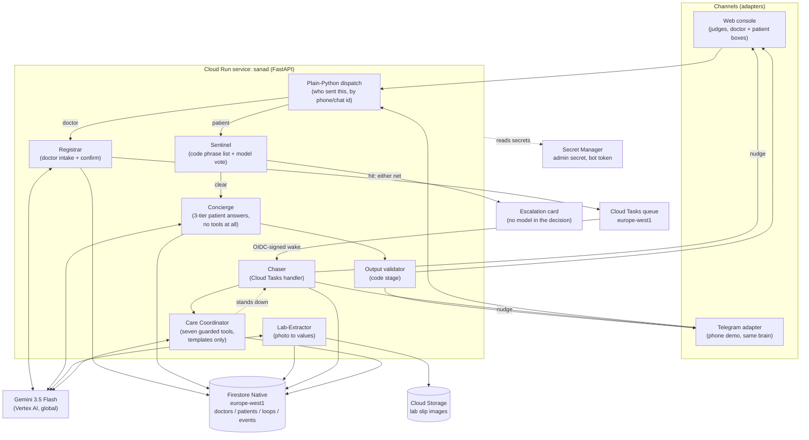

# Sanad (سند)

**Sanad** is Arabic for "the one you lean on." It is an AI agent that sits on a doctor's number and owns the part of care that currently falls through the cracks: everything that happens between one visit and the next.

**The doctor gives the plan once. Sanad carries it until reality matches.**

A hybrid autonomous care-loop system: Gemini agents understand people, evidence and barriers; a deterministic safety kernel controls clinical boundaries; durable cloud infrastructure carries the objective across time.

**All patient data here is synthetic.** Every patient, dictation, message and lab slip in this repository, including everything under `docs/seed/`, was invented for the demo. No real clinical information and no real patient's data has ever been in this system.

## The problem this comes from

A doctor sees a patient, gives instructions, and the visit ends. What happens next is usually silence. The patient does not come back for the follow-up test. He forgets when to take the new medication, or stops it without saying so. Then, days or weeks later, he messages the doctor directly, at any hour, often in a panic, because the plan was never written down anywhere he could return to and nobody was chasing the loose ends on his behalf. The doctor either drops everything to answer, or the message sits unread. Neither is sustainable across a full patient panel, and both are worse for the patient.

Sanad exists to close that gap. The doctor dictates his instructions after a visit, the way he already talks: "get a lipid panel from Ahmed in two weeks, start him on atorvastatin, check blood pressure daily for a week." Sanad turns that into a structured record and a set of care loops, confirms it with the doctor in one tap, and then owns those loops: it messages the patient at the right time, reads lab photos, answers the patient's questions strictly from the doctor's own plan, and escalates immediately if anything looks dangerous. The doctor sees a report, not a stream of raw messages. **The doctor becomes the exception handler, not the project manager.**

## Who talks to what

- **The doctor** works from a web dashboard (dictate, board, review cards) and
  carries the Telegram bot as a pager: every red and yellow card lands on his
  phone, and he can dictate a new patient into it from a corridor.
- **The patient** is on Telegram. Confirming a record produces a one-time deep
  link and a QR of the same link, printed on the prescription or held up on
  screen; one tap binds that chat to that record for good, the conversation
  lives in an app he already has, and Sanad can message him first. That last
  part is the whole reason it is a messaging app and not a web page: a web page
  cannot notify anyone and cannot be found again three weeks later.
- **The patient page** (`/p/<link token>`) is the same conversation in a
  browser, for a judge who does not want to install Telegram. It is a fallback,
  not the product.
- **WhatsApp** is the product channel, in September, and it is not in this
  repository. The
  agent core is channel-agnostic behind one `ChannelAdapter` interface, and the
  WhatsApp adapter implements the same two methods the other two do.

## What Sanad is not

It is not a diagnosis tool, it does not decide on dose changes, and it does not replace the doctor's judgment. Every clinical instruction a patient receives traces back to something the doctor wrote. Sanad's job is to remember, to chase, to read, and to know when to wake the doctor up. Nothing more.

### Privacy, and what this demo does with what you type

> This is a hackathon demo. Do not enter a real patient's name, phone number, diagnosis, photo or message into it. Everything you type or upload is stored in the demo's Firestore database and Cloud Storage bucket in `europe-west1` and may be read by the project owner while the demo is up; it is sent to Gemini through Vertex AI for transcription, extraction and replies; it is not shared with anyone else, and it is deleted when the demo is torn down. Sanad is not a medical device and its replies are not medical advice.

Everything in this repository is synthetic: the twenty background patients are invented (`app/core/background.py` says so at the top), the phone numbers are a fake `0100 000 00NN` block, and the lab slips in `docs/seed` were made for this build.

---

## Architecture

One Cloud Run service (FastAPI, Python 3.12, ADK 2.8.0) is the entire agent core. It talks to Gemini `gemini-3.5-flash` over Vertex AI, stores all state in Firestore, and wakes itself on a schedule through Cloud Tasks. There are no long-running agent sessions and no in-memory state between requests: every turn loads what it needs from Firestore, runs, appends events, and forgets everything except what it wrote back to the database.



### Why it is built this way

- **Stateless per-turn runs, Firestore as truth.** Each request builds a fresh ADK `Runner` and an in-memory session, uses it once, and discards it. Nothing is cached in the process. A restart, a scale-to-zero, or a second instance handling the next message from the same patient all behave identically, because the only memory that survives a turn is what got written to Firestore. `app/core/registrar.py` shows it directly: the `Runner` and its `InMemorySessionService` are constructed inside the request handler and go out of scope with it.
- **Three agents, and their toolsets are disjoint.** Not six. The **Registrar** turns a dictation into a proposed record and holds no tools; the **Care Coordinator** owns one care obligation and holds seven, every one of them guarded in code before it runs; the **Concierge** answers patients and holds none at all. Deciding which of them a message reaches is a lookup by sender identity in `core/dispatch.py`, not a model judgment call. The Concierge has no tool surface because ADK 2.8.0 does not allow an agent to combine structured output with tools, so the plan and open loops are fetched by plain code and injected into the prompt as text instead. There is no write tool anywhere on the patient path, so a patient conversation can never edit a record no matter what the model is told to do inside it. One caveat, which `docs/ARCHITECTURE.md` states in full: a photographed prescription is read by a direct `google.genai` call with the same schema rather than by the ADK Registrar, because an ADK agent carrying an output schema takes a text turn. Same model, same `ProposedRecord`, same code validation afterwards, and "three agents" describes the tool surfaces rather than every model call in the system.
- **The Coordinator has tools but no words.** It chooses one action from a fixed list of seven and stops: schedule the next contact, ask for the missing part of a result, classify a barrier, escalate a barrier, mark evidence received, close a loop the doctor has already reviewed, pause the reminders. Every call is put to `core/policy.py` first, in code, against the doctor's own window and limits, and a refusal comes back to the model as a reason it can choose again inside. What the patient then hears is one of eight templates, gendered and in his own language, with a date, a name or an analyte as the only variable parts: there is no path from the agent to a sentence it wrote itself. There is no tool for cancelling an escalation, changing a dose or editing the plan, so those are not refusals, they are absences. An escalated barrier is not a notice: the card carries an Answer button, and the doctor's reply reaches the patient, joins the plan, takes the obligation off hold and puts the next contact back on the queue. If the model errors or times out, the fixed S3 ladder runs exactly as it did and the audit line says `fallback: ladder (model unavailable)`; if it simply has nothing to do, which is the right answer to an ordinary question, it stands down and the Concierge answers.
- **Six administrative chores are code, not a conversation.** "I did the test", "I lost the prescription", "can I come Thursday instead", "where do I send it", "the medicine is not available", "I forgot to measure": a pattern list in Egyptian Arabic, English and Franco-Arabic matches them before any model turn, and one yes/no vote can add a match the list missed but never take one away. Two of them only answer, from a template or from the doctor's own plan text. The other four change the plan of work through the Coordinator's own guarded tools, so an intent cannot buy a contact the doctor's policy would refuse, and a guard that refuses simply hands the message back to the tiers below. The doctor sees one of the six: the medicine being unavailable, which is a barrier card, with no substitute ever suggested to the patient (`core/intents.py`).
- **Sentinel and the output validator as code stages, not agents.** Whether a message is a medical emergency, and whether a generated reply is safe to send, are both decided by code that runs before and after the model call, not by prompt instructions the model could be talked out of. Three of those stages also ask the model for one yes/no vote (triage, treatment change, reassurance), and each of those votes can only ADD a relay or an escalation and fails closed, so a model that is wrong or unreachable can cost the doctor a card he did not need and can never cost a patient a gate. See `docs/SAFETY.md` for the full mechanism.
- **Cloud Tasks wakes the agent.** A care loop with a due date does not need a doctor or a patient present to make progress. When a loop is committed, its nudges are scheduled as Cloud Tasks with future run times, in the same region as everything else. The task handler is the same code path a doctor's manual `/force_due` command hits, so the demo can compress days into seconds honestly, showing the real handler on a short timer rather than a separate demo-only code path.
- **Two-state review gate.** A loop that receives evidence (a lab photo, a monitoring value) never marks itself finished. It moves to "pending doctor review," and only an explicit doctor action closes it or sends a note back to the patient. Sanad files and flags; it does not sign off on its own findings.
- **3-tier answer fence.** Every patient message is answered in a fixed order enforced by code: the blood-pressure table first for a message that is nothing but a reading, then the Sentinel (which can only escalate, never answer), then the treatment-change gate, then the doctor's written plan (the only source for plan-specific answers), then general education under rails, with anything about changing treatment relayed to the doctor instead of answered. The change gate runs before the photo branch, so a caption under a photo is gated exactly like typed text. See `docs/SAFETY.md`.
- **Deterministic where it matters, model where it helps.** Routing, the sentinel phrase list and critical-lab table, date arithmetic, the output validator, idempotency, and what gets stored are all plain code, never a model call. The model transcribes, extracts into a schema that code validates, casts three bounded yes/no votes (emergency triage, treatment change, reassurance), phrases replies, and answers general questions under rails. Each vote can only add a relay or an escalation, never remove one, and each fails closed. Any number or drug name a patient sees has to trace to the plan, the lab slip, or a code table: a number has to match a plan number of the same kind (the plan's "7 days" does not license a reply's "7 mg"), and a capitalized or Arabic word standing next to a dose that the plan never mentions is treated as a drug the doctor did not prescribe. `app/core/validator.py` is what enforces that on the way out. Text the doctor wrote himself is the trusted path and goes to the patient as his.

### Request lifecycle, in brief (full detail in `docs/ARCHITECTURE.md`)

- **Patient message:** load patient + plan + last events → blood-pressure table (a bare reading is graded in code and never sees a model) → Sentinel (code phrase table and concept rules, then the model vote) → treatment-change gate (code, then a model vote) → the administrative tier (a pattern list, then one add-only vote that may name only the two answer-only chores; the four that change the plan of work need a code pattern match) → the Care Coordinator, if the reply is about an obligation → if clear, Concierge answers from the plan or, failing that, general education, or is relayed → output validator, then the reassurance vote → send. A red flag at either sentinel net skips generation entirely and goes straight to the canned emergency block plus a doctor card. A triage call that errors fires the gate too and relays the message to the doctor unanswered. A voice note is transcribed and the transcript is checked by the code sentinel on that same lane, before the Concierge sees it.
- **Doctor dictation:** text or voice → transcribe if needed → Registrar extracts a structured record and loop proposals → code validates the shape (loop types, required fields, real dates) → the identification step reads the dictation against the doctor's own board → confirm card → doctor taps confirm → Firestore write + Cloud Tasks scheduled for any loop with a due date. A dictation about a patient already on the board attaches to that patient, adding the new loops and appending the new instructions to his plan as a dated addendum rather than replacing it; a shared first name, a description with no name in it, or anything the code name matcher and the model do not agree on asks which one, with a button per candidate, and writes nothing until the doctor taps.
- **Scheduled chase:** Cloud Tasks fires the Chaser handler on an OIDC-signed identity → checks the demo run id, whether the loop is paused, quiet hours, the one-message-a-day rule, the doctor's own contact limits, and the idempotency key → wakes the Care Coordinator, which decides what this wake-up is for → sends the nudge in the patient's language → records the attempt. Three unanswered nudges move the loop to "unreachable" instead of retrying forever.
- **A care obligation over time:** every open loop is a Care Contract (objective, evidence required, permitted actions, one fixed safety sentence, deadline, escalation conditions), shown on the confirm card the doctor taps and on the patient's page from the same function. A wake-up, a patient reply, evidence arriving, or silence past a deadline wakes the Coordinator for that contract; it chooses one guarded tool and the reason is written to the log and printed on the card.

### The honest model-call count

A message that is nothing but a blood pressure costs no model call at all, and neither does a message the code sentinel catches. An ordinary patient question costs up to six: the sentinel's vote, the treatment-change vote, the administrative vote, the Coordinator (which usually stands down on a question), the Concierge, and the reassurance vote. A patient reply the Coordinator acts on costs four, and a message the administrative pattern list matches costs two, because the tier answers it in code. A voice note costs one more, for the transcription. A photographed slip costs one, two if the text came back sideways, and one more when the slip does not satisfy the contract. A scheduled wake-up costs one. A dictation costs two (the extraction and the identification of which patient it is about), three by voice, and one on a board with no patients on it yet, because there is nobody to identify against. A completion report costs one. Everything else, and every decision that matters clinically, is code. The full table is in `docs/ARCHITECTURE.md`.

---

## Setup and deployment

Everything below matches `app/deploy.sh`, which is idempotent: re-running it creates nothing twice.

### Prerequisites

- A Google Cloud project with billing enabled.
- `gcloud` installed and authenticated (`gcloud auth login`, `gcloud config set project <PROJECT>`).
- The following APIs enabled on the project: Cloud Run, Cloud Build, Firestore, Vertex AI, Secret Manager (and, for the scheduled-chase path, Cloud Tasks and Cloud Storage: see the note at the end of this section).

### Deploy

```bash
cd app
./deploy.sh
```

What the script does, in order (names only, no secret values ever printed):

1. Creates the Cloud Run runtime service account `sanad-run@<PROJECT>.iam.gserviceaccount.com` if it does not already exist, and waits out IAM's eventual-consistency delay before continuing.
2. Grants that service account `roles/aiplatform.user`, `roles/datastore.user`, `roles/secretmanager.secretAccessor` and `roles/cloudtasks.enqueuer` on the project, and `roles/iam.serviceAccountUser` **on itself**. That last one is the trap: a Cloud Tasks task that carries an OIDC token for a service account can only be created by an identity allowed to act as that service account, and Sanad creates tasks that run as itself. Without it every `create_task` fails with `PERMISSION_DENIED` on `iam.serviceAccounts.actAs` and nothing about the queue hints at why.
3. Creates the Firestore database in **Native mode, region `europe-west1`**, if it does not already exist. This is a one-way door: mode and location can never be changed later, only deleted and recreated.
3b. Enables the Cloud Tasks and Cloud Storage APIs, creates the `sanad-chase` queue in `europe-west1`, and creates the private bucket `sanad-506914-labs` with uniform bucket-level access and public access prevention enforced. The runtime account gets `roles/storage.objectAdmin` on that one bucket and nothing else. There is no code path in Sanad that makes an object public and no signed-URL surface: a lab photo is referenced everywhere by its `gs://` path only.
4. Creates the `sanad-admin-secret` in Secret Manager (a random value generated locally, piped straight into `gcloud secrets create`, never written to disk or echoed) if it does not already exist. This secret guards `POST /admin/seed`.
5. Creates `sanad-tg-webhook-secret` in Secret Manager (again a locally generated random value) if it does not already exist. Telegram echoes this value on every webhook call, and `/tg` rejects anything that does not match it.
6. Checks for a `sanad-bot-token` secret. If it exists (created out of band directly from the `SANAD_BOT_TOKEN` line in the local `.env` file, piped straight into `gcloud secrets create` so the token never sits in a shell variable), it is mounted and Telegram is enabled; if not, the deploy proceeds web-only and every Telegram send is a no-op until the token is added.
7. Builds the container with Cloud Build from the hand-written `Dockerfile` (never `adk deploy`) and deploys it to Cloud Run: service `sanad`, project `sanad-506914`, region `europe-west1`, 1 vCPU, 1 GiB memory, max 3 instances, running as `sanad-run`, with the secrets above mounted and `GOOGLE_GENAI_USE_VERTEXAI=true` / `GOOGLE_CLOUD_LOCATION=global` so Gemini calls go through Vertex with the service account's own credentials: no API key anywhere in the system.
8. Prints the deployed service URL.

To enable Telegram after the fact, create the bot token secret and re-run `./deploy.sh` (idempotent, so nothing else is recreated):

```bash
grep '^SANAD_BOT_TOKEN=' <path to your .env file> | cut -d= -f2- | tr -d '\n' \
  | gcloud secrets create sanad-bot-token --project sanad-506914 \
      --replication-policy=automatic --data-file=-
```

To read a secret's value yourself (it is never printed by the script or logged):

```bash
gcloud secrets versions access latest --secret=sanad-admin-secret --project=sanad-506914
```

Every resource above is created by `app/deploy.sh` and was verified against the live project on 2026-08-29: the `sanad-chase` queue in `europe-west1`, the private `sanad-506914-labs` bucket, and the three Secret Manager secrets. `GET /health` on the deployed service reports which of them are actually live, so none of it has to be taken on trust:

```json
{"ok": true, "service": "sanad", "region": "europe-west1", "project": "sanad-506914",
 "model": "gemini-3.5-flash", "chaser": "cloudtasks", "labs_bucket": true,
 "telegram": true, "run_id": "demo1", "time_scale": 86400, "revision": "sanad-000NN-xxx"}
```

The same line runs across the top of the console, so what a judge sees on screen is read from the container's own environment, not typed into a page.

### Run the seed data

After deploying, create a doctor. The admin secret travels in the `X-Sanad-Admin` header, never in the URL: Cloud Run's request log records the query string of every request and keeps it for thirty days, so a secret in a query string is a secret in a log. A request that carries `?secret=` is refused with 401.

```bash
S=$(gcloud secrets versions access latest --secret=sanad-admin-secret --project=sanad-506914)
curl -X POST -H "X-Sanad-Admin: $S" "https://<SERVICE_URL>/admin/seed?name=Judge%20Doctor"
```

`name` is deliberate: "Judge Doctor" here. Each name is its own board with its own patients, its own loops and its own console token, and a board seeded for judging is the one to use: it has no Telegram chat bound, so nothing on it can reach anybody's phone, and it is not the board the demo video was recorded against. `docs/RUNBOOK.md` section 5 has the two commands that set one up with the twenty synthetic background patients on it.

This returns a `console_url` of the form `https://<SERVICE_URL>/c/<token>`. That token is the only auth on the console in this build; treat the URL as a bearer credential and do not publish it outside the judging flow.

The same token also serves the designed dashboard at `https://<SERVICE_URL>/c/<token>/app`: board, patients, inbox, reports and settings, behind the same doctor dependency, so a wrong token is the same 404 there. The plain console at `/c/<token>` is unchanged and is still the surface every step below describes.

---

## Running the demo

1. Open the console URL from the seed response. Three panels: **Doctor** (type or upload a voice note as the doctor), **Patient** (pick a seeded patient, type or upload a photo/voice note as them), and the **board + event feed** (patients, their loops with a state emoji, and the append-only event log judges can read like an audit trail).
2. As the doctor, paste one of the dictations from `docs/seed/dictations.md`. Ahmed Ali's is the one to use first: it is the dictation every slice has been run end to end against. A confirm card appears listing the extracted loops. Tap Confirm.
3. Switch to the Patient panel, pick the newly confirmed patient, and send the Arabic test messages from `docs/seed/dictations.md` one at a time to see each tier: the code-sentinel phrase, the model-sentinel phrase, a plan question, a general question, and a treatment-change request that gets relayed instead of answered.
4. Upload `docs/seed/lab-slip-1.png` as the patient to see lab values extracted and compared against the plan's targets; upload `docs/seed/lab-slip-2.png` to see the critical-potassium path escalate instead. Three more synthetic slips are in `docs/seed`: a large-chain printed report (all values normal), a small-lab bilingual slip with handwritten values (LDL above target), and a photo taken at an angle with glare on it (potassium 6.7, critical). All five have been run against the deployed extractor, and every analyte row on them came back exactly as printed.
5. Send a photo the doctor never ordered: it is still read, still compared, and comes back as a yellow "unexpected result" card with the values on it and two buttons, keep it on the record or open a loop for it. With two tests open, the slip's own analytes decide which loop it attaches to, so a potassium result does not land on a lipid panel. Send a photo of a blood-pressure monitor and the reading joins the patient's chart, graded on the way in by `app/core/vitals.py`. Send anything else and it is stored and relayed unread. Which of those happens is decided by `app/core/photos.py`, in code, from the class the model returned and the loops the patient has open.
6. As the doctor, send `/force_due <patient name>` to make a loop due immediately through the real Chaser code path, `/force_due <patient name> <loop word>` to name which loop, and `/digest` to see the doctor-facing status roundup. Type a fragment two patients share and it names both and asks for more of the name instead of picking one.
7. Click a patient's name on the board for the per-patient view: the record (plan, targets, baseline), the loops with their results and readings, and the whole timeline of events and cards for that patient.
8. Photograph a prescription and send it as the doctor. It goes through the Registrar exactly like a voice note, into the same structured proposal, the same code validation and the same confirm card. Voice, text and photo are one path.
9. The Firestore and Cloud Tasks consoles for project `sanad-506914` show the same state live, which is the "no human in the middle" proof: the loop closes itself in the backend, not just on screen.

`docs/RUNBOOK.md` is the sequence to run before a rehearsal or a recorded take, and what to do if a beat fails while the camera is running.

---

## Honest limitations

- **Synthetic patients only.** Every patient in this demo, including the ones in `docs/seed/`, is fictional. No real patient data has touched this system.
- **Telegram and the web console are the demo channels.** The product's real channel is WhatsApp; the hackathon rules do not require Meta integration, and standing up Meta Business Verification, a WABA, and template-message approval was judged out of scope for a weekend build. The web console is channel-agnostic proof that the agent core works with zero installs for a judge; the Telegram adapter shows the same brain working from two real phones. Both plug into the same `ChannelAdapter` interface a WhatsApp adapter will implement in Phase 1.
- **WhatsApp is the product channel, planned for the month after the hackathon.** That requires registering a business entity, Meta Business Verification for Sanad as the one verified sender, a dedicated number, and utility-template approval for outbound nudges. None of that is in this repository.
- **The sentinel list is a floor, not a diagnosis.** It is a deterministic phrase list, a set of deterministic concept rules, and a model vote that can only add an escalation, never remove one (`app/core/sentinel.py`). It exists to make sure obvious emergencies are never missed by a phrasing quirk or a model having an off turn; it does not replace clinical judgment, and per-doctor additions to the list are on the post-hackathon roadmap, not shipped today.
- **Language and gender are code decisions, and the second one was a bug first.** A patient is written to in the language he last wrote in, and in the grammatical gender his record carries. The first real phone test found a female patient being addressed as a man in Arabic; `app/core/gender.py` now decides that from the record's `sex` field, every Arabic template exists in masculine, feminine and gender-free forms, and the gender-free form is what an unrecorded sex gets, not the masculine one. There are tests for each.
- **The blood-pressure table is three numbers, and only three.** `app/core/vitals.py` calls a reading critical at 180 systolic or above, at 120 diastolic or above, or below 90 systolic, and all three send the emergency block to the patient as well as the red card to the doctor. Everything between those is filed to the chart with no card of its own. It is a floor for the readings that must not be missed, not a hypertension grading scale, and it says nothing about trend, symptoms or context, which is what the doctor is being handed the chart for.
- **A patient fragment that matches two patients is refused, not resolved.** `/report Ismail` with both an Ismail Roshdy and a Hend Ismail on the board names both and asks for more of the name (`app/core/names.py`). The cost is that the doctor sometimes has to type again; the alternative was chasing the wrong patient silently, which is what it used to do.
- **The safety gates are tuned to over-relay.** An unknown word next to a dose, a number of the wrong kind, a paraphrase that looks like a treatment change, a triage call that timed out: each of those hands the message to the doctor rather than answering it. That is the direction the errors are supposed to point, and the price is cards the doctor did not strictly need.
- **A lab value the table cannot judge is escalated, not filed.** An unconvertible unit, an unreadable number on a flagged row, or an analyte with no table row that the lab flagged HH/LL/critical produces an amber-red "URGENT REVIEW" card (`app/core/labs.py`). Sanad does not decide those; it refuses to let them look normal.
- **The Coordinator is a model choosing between seven doors, and the doors are code.** It cannot write a sentence to a patient, cannot cancel an escalation, cannot change a dose, cannot edit the plan and cannot close a loop the doctor has not reviewed. What it can do is pick the wrong one of the seven, and the honest failure mode is a card the doctor did not need or a reminder moved a day too far. Every guard it has to pass is in `app/core/policy.py` with a test beside it, and if the model is unavailable the fixed ladder runs instead.
- **"Lost: zero" is a property of the counting, not a promise about the world.** The end-of-day summary counts every obligation into exactly one of six buckets, so the numbers always add up. It says nothing about a patient who never bound his phone, and nothing about a result that was never sent.
- **The name on a lab slip is matched fuzzily, and fuzzy has two failure directions.** A slip whose printed name shares no part with the record never attaches and goes to the doctor as an identity check that failed, which will sometimes be a real result with a badly typed name. A slip printed in Arabic against a record written in English is reported as "cannot compare" rather than as a mismatch. Nothing here transliterates, and nothing attaches on a guess.
- **All-specialty scope, cardiology-shaped demo.** The sentinel list, lab extraction, and targets are written to be specialty-agnostic; the demo's lead patient happens to be cardiology because that is the doctor's own story.

## License

MIT. See `LICENSE` in the repository root.
