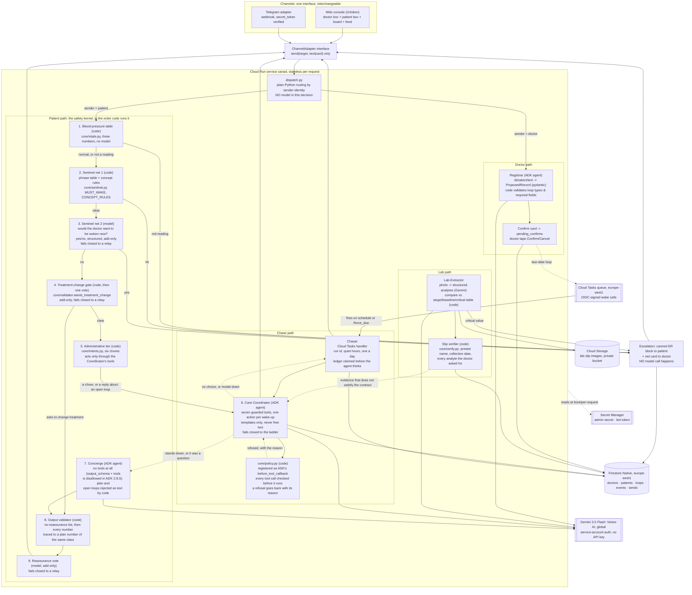

# Sanad - Architecture

This document describes the checked-in architecture. Where a claim is about behavior, the named file is the implementation and `app/tests/` is the reproducible evidence. Deployment history and private slice/review material are intentionally not asserted by this public document.

## Positioning

A hybrid autonomous care-loop system: Gemini agents understand people, evidence and barriers; a deterministic safety kernel controls clinical boundaries; durable cloud infrastructure carries the objective across time. The product line is the same sentence from the other end: **the doctor gives the plan once, and Sanad carries it until reality matches.**

There are **three agents**, never six, and their toolsets are disjoint:

| Agent | What it decides | Tools | Output |
|---|---|---|---|
| **Registrar** (`core/registrar.py`) | what the doctor just dictated | none | `ProposedRecord`, a pydantic schema code then validates |
| **Care Coordinator** (`core/coordinator.py`) | what to do next about one open obligation | seven, listed in `core/policy.TOOLS`, each one guarded in code before it runs | one tool call, or nothing |
| **Concierge** (`core/concierge.py`) | how to answer one patient message | none at all, by design | `ConciergeAnswer`, checked by the validator before it is sent |

No agent holds another's tools. The Concierge, which is the only one a patient talks to, has no tool surface at all: ADK 2.8.0 does not allow `output_schema` and `tools` on the same agent, so the plan and the open loops are fetched by plain code and injected as text. The Coordinator has tools but no words: every sentence it can send a patient is a template in `core/templates.py`. The Registrar writes nothing until the doctor taps Confirm.

**One caveat, stated here rather than left to be found.** There are three ADK agents, and a photographed prescription produces the Registrar's output through a non-ADK path. `registrar.propose_from_image` calls Gemini through `google.genai` with `response_schema=ProposedRecord`; both text and image proposals then pass the same code validation. "Three agents" describes tool surfaces, not every model request. After the deterministic-report change, `core/` contains eight direct `google.genai` call sites/categories: Sentinel vote, treatment-change vote, reassurance vote, administrative vote, slip extraction, transcription, prescription read and identification. Completion reports no longer call a model.

A rendered image version of the diagram below is at `docs/architecture.svg`, for use on Devpost where an embedded mermaid block will not render. The two are kept node for node: `app/tests/test_architecture_diagram.py` fails the image build if a node exists in one and not the other, which is how the S4 diagram was allowed to sit two slices behind the code until rev 17.

## System diagram



## Request lifecycle 1: a patient message

1. **Load.** The handler resolves the sender to a patient record, then loads that patient's plan text, targets, open loops and recent events from Firestore. A voice note is transcribed first. Every photo enters extraction/classification. A lab result with no open TEST loop is still extracted and compared, then shown as an unexpected-result card; a critical row still escalates.
2. **The blood-pressure table (code, before either net).** A message that is nothing but a reading is graded by `core/vitals.py` first: three numbers, no model. A red reading is filed to the patient's monitoring chart when one is open, the patient gets the emergency block, and the doctor gets a red card naming the table in `decided_by`. A reading the table calls normal is filed when possible, acknowledged with fixed code wording and exits without entering the Sentinel or creating a doctor card.
3. **Sentinel net 1 (code, always runs first on anything that is not a bare reading).** The text is normalized (Arabic diacritics stripped, common letter variants unified, lowercased, Franco-Arabic digits kept, Franco spelling variants folded onto one form) and matched against the phrase table `MUST_WAKE` in `core/sentinel.py`, then against `CONCEPT_RULES`, which match token sets rather than sentences (chest with pain, breath with an inability, face with drooping, a limb with weakness, lips with blue). A hit on either skips every later step: no model call happens at all. The patient gets the canned emergency block in his own language, an escalation event is written, and the doctor gets a red card naming the patient, the quoted text, the matched concept, and the time.
4. **Sentinel net 2 (model, always runs if net 1 was clear).** One Gemini call asks a strict yes/no question: would this patient's physician want to be woken right now by this message? The never-wake examples from `sentinel.NEVER_WAKE` are supplied as negatives. A "yes" takes the identical emergency path, marked on the event as caught by the model net rather than the code net. Both nets always run in sequence; either firing is sufficient, and which one fired is stored on the event, which is the audit trail shown in the demo. The call fails closed: an error or a timeout fires the gate as `model:error`, the patient gets the relay line, and the doctor gets a yellow "triage unavailable, please read" card carrying the message verbatim.
   **The modality boundary.** For voice notes the code sentinel runs on the transcript, which is a model output; the modality boundary is stated. `core/dispatch.py` transcribes on the patient lane and calls `sentinel.check` on the transcript there, before the Concierge is called, and passes the verdict in. Image content is model-read, and the caption on an image is patient text that goes through the sentinel and the change gate before the extractor.
5. **A code gate before the model ever runs, and before the photo branch.** A request to change treatment (`validator.wants_treatment_change`, literal phrases plus token rules in Arabic, Franco-Arabic and English) is matched in code and never reaches the Concierge at all: the relay line is produced directly, with no generation in that path. If the code list is clear, one yes/no model vote (`validator.model_change_vote`) is asked, and it can only add a relay; it fails closed. Both run before the photo branch, so a caption asking to double a dose is gated exactly like the same sentence typed on its own.
5b. **The administrative tier: code patterns before its optional model vote** (`core/intents.py`). This tier runs after the Sentinel and treatment-change model votes, so it is not "before any model turn." Six chores are code-matched in Egyptian Arabic, English and Franco-Arabic. If patterns miss, one bounded vote may add only either answer-only intent. The four state-changing intents require a code match and then use Coordinator guards. A refusal writes an audit event and the message falls through unchanged.

**Where the guard is wired.** `core/policy.check` runs at two points, on purpose. The first is ADK's own `before_tool_callback`, registered on the Coordinator agent (`core/coordinator.before_tool`): the framework calls it with the tool and its arguments before any tool body runs, and a dict returned from it becomes the tool's answer, so a refused call never enters the function at all. The second is the `propose` at the end of each of the seven tool bodies, which is the line that still holds if the callback is dropped by an SDK upgrade, and the one the administrative tier uses, because that caller is code and never goes through an agent turn. `Turn.precheck` hands the accepted answer from the first through to the second, so the doubled call costs nothing and changes nothing. Two enforcement points, one rule, one file.

5c. **The Care Coordinator, before any generation and after every gate.** If the message is not a bare reading, is not a treatment-change request, and the patient has an obligation Sanad is still carrying, the Coordinator is woken for that obligation (`core/coordinator.py`). It reads the objective, the loop's own numbers, the doctor's policy and the last ten events, and it calls exactly one of seven tools. Every call is put to `core/policy.check` first, in code, and a refusal comes back to the model as a reason it can choose again inside. Whatever it decides, the patient hears a template and never a generated sentence: "we will check again on 2026-09-01", "I told Dr Mohamed about the cost", "please send the missing part: Potassium". If it errors, times out, calls nothing, or has every call refused, it stands down and the Concierge answers exactly as it did before S6. That is the fail-closed default and it is the same one the Chaser uses.

6. **Concierge, tier order enforced by code.** For everything else, an ADK agent answers with `output_schema=ConciergeAnswer` and **no tools at all**: ADK 2.8.0 does not allow an agent to carry both `output_schema` and `tools` in the same definition, so the plan and the patient's open loops are fetched by plain code and injected directly into the instruction text rather than exposed as callable tools (`app/core/concierge.py`: "on the patient path there is no tool surface at all, writable or not"). The instruction fixes the tier order: plan questions are answered only from the injected plan text; general questions get education framed as general information: the model is told not to write a single digit, dose, or measurement in a general-tier answer at all, describing things in words instead: always closing with a line that the doctor's plan is what counts; anything the model is not confident about gets the relay line in the patient's language instead of an answer, flagged for the doctor. The patient's own text sits inside a clearly delimited block the instruction marks as untrusted, so nothing inside it can rewrite the agent's rules: this is what makes the jailbreak-refusal demo beat honest rather than a scripted denial.
7. **Output validator (code, always runs on whatever came back, model-generated or code-shortcut, before send).** A no-reassurance list (Arabic, English and Franco-Arabic phrases such as "don't worry," "it's normal," "mafeesh moshkela," with the Arabic examples in `docs/SAFETY.md`) replaces the whole reply with the relay line if matched. Every number is read with the unit beside it and has to match a plan number of the same class, so "7 days" in the plan never licenses "7 mg" in a reply; word numbers, Unicode superscripts and Arabic-Indic digits are folded to digits first. A general-tier number framed as a range is allowed only in a sentence with no unit, no imperative and no drug name. A drug not in the plan mentioned with a dose forces a relay, and so does any capitalized or Arabic word within thirty characters of a dose or of "take" that the plan never mentions. The verdict is stored on the event.
8. **The reassurance vote (model, add-only, fails closed).** A reply the code rules passed is put to one yes/no call: does this minimize, reassure, or tell the patient not to worry? A "yes" relays. No model-generated reply reaches a patient without both gates. A reply the doctor wrote himself is the trusted path and goes through neither.
9. **Send.** The reply (or the relay line) goes out through the same `ChannelAdapter` the message arrived on. A relayed message also produces a yellow doctor card; the doctor's answer to that card is delivered to the patient prefixed with his name, and is appended to the plan as a dated addendum: the one-message correction rule, so the next patient question already sees the update.

## Request lifecycle 2: a doctor dictation

1. **Load.** Text, or audio transcoded and transcribed the same way as the patient path.
2. **Registrar (ADK agent, `output_schema=ProposedRecord`).** One turn uses an `InMemorySessionService` created and discarded within the request, visible in `core/registrar.py`. The model extracts a structured patient candidate and proposed loops; code validates the shape before display. Relative `due_in_days` values become timestamps in Python at commit.
3. **Code validation, before anything is shown to the doctor.** Every proposed loop must carry a type from the fixed enum; a MEDICATION loop must have a drug and an action; a TEST loop must have a test name. A dictation that fails this comes back as a request to restate, not a half-formed record. A placeholder name ("Unknown," "N/A," or its Arabic equivalent) is treated as a missing name and triggers the same "please restate" response rather than silently creating a patient with a placeholder identity: a defect the S1 build surfaced and the S2 carry-over list fixes.
4. **Identification: which patient is this about (S9).** Before the card is built, two answers are taken and code decides between them. The first is `core/names.resolve`, the same name matcher `/report` and `/force_due` use, run over the doctor's own board: nobody, exactly one, or more than one. The second is a Gemini read (`core/identify.py`), given a compact list of up to fifty of his patients, the most recent by last event, with id, name, age, sex, diagnosis, last seen date, and the free-text notes he has made about who each of them is. It returns a structured verdict: an intent (`new_patient`, `existing_patient`, `lookup`, `unclear`), candidate patient ids with a confidence and a one-line reason quoting the words that matched, and any relationship worth remembering ("father of Dr Tarek", "lives in Zagazig"). It exists because a doctor does not always say a name: "the father of my friend Tarek" and "the old lady I saw last week with the swollen legs" are what a name matcher has nothing to say about.

   The rules over that verdict are code, and they are the whole safety argument. An explicit "this is a new patient", in Arabic or English, matched by a phrase list, always wins as new whatever the model returned. The auto-selected "Existing patient" card needs both halves to agree and each of them to name exactly one patient: one name match in code, one model candidate at or above the confidence threshold, and the same id. Anything else asks, with one button per candidate labelled "Ahmed Ali, 58, heart failure" and the model's quoted reason printed beside it: a description-only match asks, a confidence below the threshold asks, two candidates ask. "unclear" asks for the name. "lookup" lists the matching records with a button that opens one and creates nothing at all, not even a pending proposal. A model error or a malformed verdict falls back to the code name matcher and to the ask card, never to a silent guess, and no path attaches a dictation to a record without the doctor tapping the record's own name.

5. **Confirm card.** One event, one card, with the plan summary and each loop as a line. On a new patient the title says "New patient: Mariam Fouad" and the buttons are Confirm and Cancel. On an existing patient the title says "Existing patient: Ahmed Ali, 58, heart failure", the lines separate what is being added (the new loops, each as its contract) from what is being changed (only the demographic fields the dictation actually mentioned, printed as "old becomes new"), the plan is shown as the dated addendum it will become, and a third button says "This is a new patient" and switches the proposal back with one tap.
6. **Commit.** On confirm of a new record, the patient and loop documents are written to Firestore, any due-dated loop gets its nudge schedule created as Cloud Tasks, and a deep-link token for patient onboarding is generated (Telegram) or the patient is marked active directly (web demo). On confirm of an addition, the new loops are created on the existing record and only those are scheduled, the plan grows a dated addendum through the same function the doctor's own relay answers use (`core/concierge.with_addendum`) and is never replaced, the fields the dictation did not mention are not touched, baseline and target metrics are merged by name, any relationship note is appended to `patient.notes` with its date, and no second link is minted because the patient already has one. On cancel, the proposal is discarded and nothing is written.

## Request lifecycle 3: a scheduled chase

1. **Wake.** Cloud Tasks fires the Chaser handler at the scheduled time (or immediately, if a doctor sent `/force_due`, which enqueues the identical task type with a near-zero delay rather than running a separate demo-only path). The request must carry a valid Google-signed identity token for the runtime service account; the task-creating identity is separately granted permission to act as that service account, which is documented as the known trap in Cloud Tasks + Cloud Run setups.
2. **Guard checks, in code order.** The handler drops stale run/schedule versions, re-arms long hops, and drops paused or patient-opted-out loops. For a non-forced wake it applies `core/policy.check` to the schedule/contact limits before quiet-hours parking (22:00 to 09:00 Cairo) and the patient-wide daily ledger. That order makes a capped strict wake visibly refused even at night; an allowed quiet-hours wake is deferred and writes a feed event. A forced wake bypasses quiet hours, daily and maximum-contact admission but is still counted. The generation-aware send ledger is claimed before the Coordinator or send.
2b. **The Coordinator decides what the wake-up is for.** It is asked before anything is sent. On a wake-up with nothing new from the patient the answer is `schedule_next_contact` with zero days, which means "the reminder that is due now", and the ladder step below is what carries it out. Anything else it chooses (a barrier to escalate, a loop to pause, a contact to move) happens instead of the nudge, and the audit line says which tool and why. When it stands down the ladder runs unchanged, and the audit line says `fallback: ladder (model unavailable)`.
3. **Nudge.** If all guards pass, the patient is messaged in his own language through his adapter, naming the doctor, offering help if the underlying issue is the blocker, and the attempt is recorded. `attempts` is the ladder counter and any patient reply resets it; `contacts` is every message the loop has ever cost the patient and it never resets, which is what makes the six-contact promise true.
4. **Patient response.** Any reply on an open loop resets the attempt counter. If the reply is the expected kind of evidence (a lab photo on a TEST loop, a value on a MONITOR loop), it routes into the Lab-Extractor or the monitoring table; otherwise it is logged and, if unclear, relayed.
4b. **The 720 hour ceiling, and the hop that gets past it** (`core/tasks.py`). Cloud Tasks refuses a schedule time more than 720 hours out, which is a hard API limit. "Come back in a month" opens a visit due in 30 days whose last ladder rung lands at 33, and before this was fixed that made the create call throw and the whole Confirm return 500 with no patient link ever minted. No task now carries a delay longer than 28 days: a contact further away is scheduled for 28 days with its real moment written into its own body, and when it fires the handler sees the moment has not come, puts it back on the queue for what is left, sends nothing, and writes "re-armed for 2026-09-30" so the extra wake-up explains itself. A re-arm is not a contact: nothing is counted, nothing is claimed in the ledger and the patient hears nothing. The link is also minted before the queue is touched now, and a queue that refuses is a yellow card on the doctor's board rather than a failed Confirm: the record outlives the queue.

5. **Give up gracefully, not silently.** After three unanswered nudges, the loop moves to `unreachable`, the doctor gets a white card and the loop remains open. Unit and race tests cover stale-run and duplicate-delivery behavior.

## Request lifecycle 4: a photograph

Every photo is read. What happens next is a two-column table and nothing else.

1. **Claim, upright, then store.** A SHA-256 receipt keyed by patient and Cairo day is claimed transactionally in Firestore before storage or model work. Exact bytes received again that day create one fixed duplicate acknowledgement and a feed event, not another result, card or model call. A new image is turned upright from its EXIF tag, written to `gs://<PROJECT>-labs/<run id>/<patient id>/<uuid>` in the private bucket, and records carry the resulting path. Image bytes do not enter Firestore.
2. **One model call: what is it, and what does it say.** Gemini returns a structured `PhotoReading`: a class (`lab_slip`, `bp_monitor`, `prescription`, `other`), the orientation of the printed text, and the transcription - analyte, value, unit, the slip's own printed reference range, the slip's own printed flag, or the systolic/diastolic/pulse on a monitor screen. The prompt and the schema both forbid interpretation, and nothing downstream reads one. If the model reports the text as sideways, code rotates the image and asks once more. Once, never in a loop.
3. **Routing, in code (`app/core/photos.py`).** The class the model returned, plus which loops the patient has open, decide the route. Nothing else does:

   | class | open TEST loop | open MONITOR loop | route |
   |---|---|---|---|
   | `lab_slip` | yes | - | attach to that loop, move it to pending review |
   | `lab_slip` | no | - | yellow "unexpected result" card: same values, plus two buttons (keep it on the record, or open a loop for it) |
   | `bp_monitor` | - | yes | the reading joins that loop's chart |
   | `bp_monitor` | - | no | the reading is shown to the doctor, unfiled |
   | `prescription`, `other` | - | - | stored and relayed unread |

   The TEST states that still welcome a slip include `unreachable`: a patient who stopped answering and then sends the result a week later has still sent the result.

   **Which open test takes the slip.** With one open TEST loop there is nothing to decide. With two, the slip's own analytes decide: `core/labs.panel_analytes` expands the doctor's own words for the test ("Kidney function tests") into the analytes that panel is made of, and `core/labs.panel_overlap` counts how many of the slip's rows are among them. The highest count wins, with the oldest loop taking a tie. Until S6 that count was over shared title *words*, which meant a lab that printed nothing but "K" and "Na" overlapped a kidney loop by zero; it is analyte level now. Nothing about this touches whether a value is critical; it only decides which loop the result is filed against.

   **The three verifier checks, before a slip may satisfy a contract** (`core/verify.py`, S6+ item B). The name printed on the slip has to be the name on the record, compared fuzzily in both scripts through `core/names.same_person`, so a title, a missing middle name or an Arabic spelling variant is still the same person. The collection date has to be on or after the day the doctor ordered the test. Every analyte the contract asked for has to be present. A partial result and a result collected before the order both attach and both keep the contract open: the evidence is real, it is just not yet the evidence that was asked for, and the Coordinator's `request_missing_evidence` names the missing part to the patient. An identity mismatch, or two names written in two different alphabets, never attaches at all: the values still reach the doctor, on a card that says the identity check failed, and a critical value on such a slip still escalates, because the direction the errors point is towards the doctor and never towards silence.

   **The two numbers on a monitor screen are graded too.** A photographed reading is judged by `core/vitals.py`, the same table a typed reading meets, before the doctor's card is built. That is what makes the card red rather than green when the machine reads 190/125.
4. **Comparison, in code (`app/core/labs.py`).** Every lab row is converted into the table's own unit and then judged against the critical-value table, the doctor's target for this patient, and the doctor's recorded baseline, in that order. A unit with no conversion, a number the parser could not read on a row the lab flagged, or an analyte with no table row that the lab flagged HH/LL/critical produces an amber-red "URGENT REVIEW" card instead of an ordinary yellow one. The analyte names and flags the model read back are also passed through the sentinel word list, because they are model output too. A critical value takes the identical escalation path as a Sentinel hit - the canned emergency block to the patient, a red card to the doctor - on every route, including the one with no order behind it. `decided_by` on the event names the table.
5. **The same photo from the doctor is a dictation.** A prescription photographed by the doctor goes to the Registrar, into the same `ProposedRecord` schema a voice note produces, through the same code validation, to the same confirm card. Voice, text and photo are one path with one gate at the end of it.

## Request lifecycle 5: one care obligation, over time

This is the S6 slice, and it is the difference between a reminder and an agent that owns something.

1. **The Care Contract** (`core/contract.py`). Every open loop is rendered as six things: the objective (what, for whom, by when), the evidence required (which analytes, and the three checks a slip has to pass), the permitted actions (the seven tools and nothing else), one fixed safety sentence, the deadline (the due date and the end of the doctor's window), and the escalation conditions. Nothing new is stored: a contract is the loop plus the doctor's policy, rendered. The doctor sees it on the confirm card he taps and on the patient's page afterwards, from the same function, so the two cannot drift apart.
2. **The doctor's policy** (`core/policy.py`). The record includes schedule window, grace, six contacts per loop, one per day, evidence-request limit, cost rule and a pre-approved follow-up line. Its default quiet window comes from the same `core/timing.py` constants as the Chaser: 22:00 to 09:00 Cairo.
3. **The wake-ups.** A Cloud Task firing, a patient reply the sentinel and the change gate have already passed, evidence arriving that did not satisfy the contract, and silence past a deadline (which is the same Cloud Task, with the deadline in its facts). Which obligation a text reply is about is decided in code, from the words in it: a message carrying the words a lab answers to goes to the lab loop and not to the oldest one, and a message that fits two of them equally well falls back to the oldest rather than guessing (`core/coordinator.carrying`).
4. **The choice.** One ADK agent turn, `gemini-3.5-flash` on Vertex, the same client setup the Registrar uses, with seven tools and a timeout. The tools do not act: each one calls `core/policy.check` and returns "accepted" or "refused, because", and the accepted one is carried out by code after the turn ends. Only one action per wake-up; a second call is refused with that reason.
5. **The guards, each with a test** (`app/tests/test_policy.py`). The schedule window, the seventh contact, the two evidence requests, the eight barrier classes, escalation always allowed, evidence only when there is some, closing only after the doctor's own review flag, pausing only with a barrier recorded. There is no tool for cancelling an escalation, changing a dose or editing the plan: those are not refusals, they are absences.
6. **What the patient hears.** Eight templates, in Arabic and English, in three grammatical genders, with a date, a name and an analyte as the only variable parts (`core/templates.py`, `app/tests/test_templates.py` asserts that no template carries any other field and that none of them contains a digit). Five are the tools' own; three were added by the administrative tier (the doctor was told and no substitute will be suggested, the plan sent again, and where to send a photo). The plan text a lost prescription re-sends is not a template and not generated either: it is the doctor's own confirmed words, sent again.
7. **The barrier card is a two-way door.** An escalated barrier opens a relay carrying the loop's id and the card carries the same Answer button a Concierge relay card carries. The doctor's answer goes to the patient down the one path that already existed, lands in the plan as a dated addendum, and, because the relay names the loop, takes that obligation off its barrier and puts the next contact back on the queue through the same schedule guard (`core/coordinator.resume_after_answer`). Answering the same card twice schedules one contact, because the first answer already unpaused the loop.
8. **Doing nothing is a choice too.** The model may call no tool and answer NONE, which is the right answer to a question, a greeting or anything that is not about whether this patient is doing this obligation: those are the Concierge's, and a card the doctor did not need is a real cost. A voluntary stand-down is written as `handed to concierge` (or `handed to the ladder` on a wake-up); the `fallback: ladder (model unavailable)` wording is reserved for a model that could not be used at all.
9. **The audit line.** Every choice, its stated reason, the guard that allowed or refused it, and `decided_by: model choice, guards in code`, written to the event log and printed on the card.

## The end-of-day summary

`GET /c/{token}/summary` and the `/digest` command are counted from the records in code; no model is asked and none ever will be. Every obligation the doctor has falls into exactly one of six buckets (`core/summary.classify` is a total function whose last branch is an else), so the buckets always add up to the number carried and **"lost" is zero by construction rather than by hope**. The suite drives every combination of state, barrier, pause and review flag through it and asserts that sum.

## The monitoring summary

A monitoring loop is a schedule, so "eleven readings arrived" is not the answer to what happened; which eleven is. `core/monitoring.py` counts one loop into one sentence, in the shape S6++ item H fixes:

```
Requested: BP twice daily for seven days · Expected readings: 14 · Received: 11 ·
Missing: evenings on days 3, 5 and 6 · Trend: 144/89 to 138/83 · Threshold alerts: 0 ·
Patient-reported barrier: none
```

Every number is computed from that loop's readings. Cairo noon separates morning and evening; a threshold alert is a reading `core/vitals.py` calls red. Contract day one begins when the doctor confirms and the plan/welcome first asks for the readings; Cloud Tasks queues reminders only for days two through N. A reading on confirmation day therefore fills a day-one slot. A trend needs at least four numeric readings, which prevents the first-three and last-three groups from being identical; one reading says `not enough readings`, while two or three say `too early`. No model is asked.

## The twenty background patients

`POST /admin/seed-background` puts twenty invented patients on a doctor's board across specialties, genders and states, all of them writing English since S14. They are a table in `core/background.py`: made-up names, conspicuously formatted demo phone values, textbook diagnoses and no photographs. The phone pattern is not an officially reserved range and must not be dialled. The seeder creates no task or outbound message; deterministic ids make a second seed replace the same twenty. `app/tests/test_background.py` checks the runbook's summary against the fixture.

## The honest model-call count

One "call" below is one request to Gemini. Everything else in Sanad is code.

| What happens | Calls | Which ones |
|---|---|---|
| A red bare blood-pressure reading | **0** | the table files and escalates it in code |
| A non-red bare blood-pressure reading | **0** | code table, optional monitoring write, fixed acknowledgement; no doctor card |
| A patient message the code sentinel catches | **0** | no generation happens at all |
| A patient message the code change-gate catches | **1** | the sentinel's model net |
| A patient message an administrative pattern matches | **2** | sentinel net, change vote; the tier itself is code, and it answers instead of the Coordinator and instead of the Concierge |
| A patient reply the Coordinator acts on | **4** | sentinel net, change vote, administrative vote (which names nothing), Coordinator |
| An ordinary patient question | **up to 6** | sentinel net, change vote, administrative vote, Coordinator (which stands down), Concierge, reassurance vote |
| The same as a voice note | **+1** | the transcription |
| A photographed lab slip, no caption | **1 or 2** | the read, plus one more read only if the text came back sideways |
| The same slip when it does not satisfy the contract | **+1** | the Coordinator, to ask for the missing part |
| A scheduled wake-up | **1** | the Coordinator, and 0 when it is switched off |
| A doctor dictation, typed | **2** | the Registrar extraction, as an ADK agent turn, then the identification read of which patient it is about |
| The same on a board with no patients on it | **1** | there is nobody to identify against, so no second call is made |
| A photographed prescription | **2** | the same model and the same schema, called directly (see the caveat under Positioning), then the identification |
| The same dictated by voice | **3** | transcription, then the Registrar, then the identification |
| A completion report | **0** | assembled deterministically from stored facts |

A dictation cost one before S9 and costs two now: the second is the identification, and it fails closed to the code name matcher and a card that asks, so a model that is wrong or unreachable costs the doctor one tap and can never attach a dictation to the wrong record. Before S6 the ordinary question cost up to four and a wake-up cost none. The Coordinator is one call added to each and the administrative vote is the other, and every one of them fails closed: an error or a timeout costs the doctor a card he did not strictly need, never a gate a patient should have met. The administrative tier is the only one that can also take a call away: a message its pattern list matches is answered from a template, so it costs two calls where the same message used to cost five.

## The demo run id and the compressed clock

Two settings live in Firestore and can be changed at run time through `POST /admin/settings`, so a rehearsal never needs a redeploy between takes (`app/core/settings.py`).

- **`run_id`.** Every task created is stamped with the run id current at creation. The handler drops a task whose stamp is not the current one, without sending anything, and logs why. Bumping the run id is therefore an instant kill switch for everything already queued, and unlike purging the queue it does not depend on eventual consistency.
- **`time_scale`.** How many real seconds make one Sanad "day". The value is read when tasks are created. Changing it later does not reschedule existing Cloud Tasks. At 3, loops confirmed while the setting is already 3 run on the compressed clock; MONITOR and other loop tasks may fire alongside the test ladder. Quiet hours apply only at real scale.

## The console, and the patient's page

Both are plain HTML served by the same service. No build step, no framework, nothing to install.

- **`/c/<web token>`** is the doctor's console and the judge's whole demo surface: a header naming the service, region, project, revision, run id, time scale and chaser engine, all read from the container's own environment; four counts over the board (`app/core/board.py`) and the one line they add up to, "3 need you, 17 handled"; the board, where a patient's name opens the per-patient view (record, loops with their results and readings, and that patient's whole timeline); the append-only event feed, where every card carries its audit line - tier, which nets ran, the validator's verdict, which tool the Coordinator chose and the guard that allowed or refused it, `decided_by`; a Demo panel whose six buttons fill the doctor or patient box with the exact demo text and send nothing; a Reset board button behind the admin secret; and the QR of the latest committed patient, inline, so a phone can scan it off the screen.
- **`/c/<web token>/app`** is the same board, drawn to the design system in `design-system/MASTER.md`: board, patients, inbox, reports and settings, behind the same `current_doctor` dependency as the console above, so a wrong token is the same 404. It reads four routes the plain console does not. `/c/<token>/cards` returns only the cards that still need the doctor: pressing a button writes `meta.card.resolved` back onto the card event (`core/cards.py`), so a page reload no longer resurrects a card the doctor already finished, and the feed still returns everything because the feed is the history. One button is exempt and only one, "Send a note": it is a side message to the patient, the card behind it is a result still waiting for the doctor's review, and the Inbox must not hide a result he has not reviewed. `/c/<token>/reports` returns completion reports and digests as records, stored the moment each one is written, rather than by matching the first line of an event against its heading. `/c/<token>/settings` returns the doctor's own record and his Coordinator policy, read only, with whether a Telegram chat is bound but never the chat id itself. And `/board` now carries `next_due`, `last_event_ms`, `last_event_kind`, `channel` and `link` per patient, all computed from the records in `core/views.py`: the page used to derive the last event from the newest two hundred feed events and the channel from whether the bot was configured at all, which is a fact about the deployment and not about the patient. The plain console at `/c/<token>` is unchanged.
- **`/c/<web token>/summary`** is the end of the day as a JSON record and a card: the fixed sentence with the day's numbers in it, counted from the loops, the events and the open questions, with `lost` in the payload so it can be read rather than believed.
- **`/p/<link token>`** is the patient's own page: the same one-time link, opened in a browser instead of Telegram, with text, a voice note and a photo. Same patient record, same brain, same gates. It does not burn the link token, so opening it never costs the patient the Telegram binding.

## Failure-tolerance story

- **Idempotency key.** Every scheduled send is keyed on `(loop_id, generation, kind, attempt)` and claimed in Firestore before work. Tests cover duplicate handler delivery and per-channel retry; exactly-once delivery at an external messaging provider is not claimed.
- **Inbound patient serialization.** A Firestore lease admits one ordinary expensive turn per patient across Cloud Run instances. A competing message gets a fixed busy reply without a model call; a deterministic code-net emergency bypasses that lease. Leases are owner-checked on release and expire after five minutes if an instance dies.
- **Photo receipt.** Exact image bytes are keyed by `(patient, Cairo day, SHA-256)` and claimed before storage or extraction. A completed receipt remains a duplicate for that day; only the owner may complete or release an in-progress claim.
- **Demo run id.** Every task enqueued during a rehearsal is stamped with the current run id. A handler that fires with an older run id is dropped without sending anything. This exists specifically so that purging the queue and starting a fresh take for the recorded video can never have a stray task from an earlier rehearsal land on a phone mid-recording.
- **Stale task drop.** Run id and schedule version invalidate tasks from a reset or reschedule. Idempotency drops an already-sent receipt; quiet hours defer rather than drop. Mere age by itself is not a general stale-task predicate.
- **Deadlines on external model/storage calls.** `core/bounded.within` wraps the triage/output votes, Concierge reply, voice transcription, photo read and bucket write. Firestore operations are not inside this wrapper, so this is not a promise that every dependency is bounded or that a patient route can never return HTTP 500.
- **The doctor knows before the patient is told he knows.** "Your doctor has just been alerted" is written last on every escalating path, after the escalation event, the relay and the doctor's card exist. One function, `core/escalate.told_or_fail_closed`, owns that ordering and the fallback that goes with it, so no branch can be given the promise without the sentence to say when the write fails. The fail-closed emergency block keeps the instruction to go to hospital and drops only the claim about the doctor.
- **A message that never left costs nothing.** The Chaser writes the loop state, the counters and the audit event before the send, so a delivery that dies mid-flight can never leave a delivered message uncounted. The contact against the doctor's six-per-loop policy limit is the one thing handed back when the delivery explicitly fails (`store.refund_contact`), and `chaser.resend` counts it again when the retry gets through, so the number of contacts on a loop stays the number of messages that reached the wire.
- **Fallback engine.** `core/tasks.py` carries an in-process scheduler behind the same enqueue interface, and `/health` reports which engine is active. It is a development fallback, not durable across instance restart and not evidence of Cloud Tasks when selected.

## Data model (Firestore)

- `doctors/{doctor_id}`: name, specialty, language, `web_token` (the console URL's only auth in this build), created_at, and since S6 `policy`: the Care Coordinator's window, contact limits, quiet hours, cost rule and pre-approved follow-up line. An absent or unreadable policy is the defaults in `core/policy.py`, never a guard that does not guard.
- `patients/{patient_id}`: doctor_id, name, phone, age, sex, diagnosis, baseline, targets, `plan_text` (the single source Concierge may quote), channel bindings, status.
- `loops/{loop_id}`: patient_id, type (TEST/MONITOR/MEDICATION/VISIT/TASK), title, details, state (open → waiting_patient → received/pending_review → done, or → unreachable), due_at, attempts. Since S6 also: `contacts` and `contact_days` (every message this loop has ever cost the patient, which never resets, unlike `attempts`), `evidence_requests`, `barrier` and `barrier_note`, `reluctance`, `paused`, `doctor_reviewed` (the two-state gate's own flag, set only by the doctor's tap), and `verified` (what the three verifier checks said about the evidence).
- `events/{event_id}` (append-only): patient_id (nullable), doctor_id, loop_id (nullable), kind (doctor_in/patient_in/agent_out/card/system/escalation), channel, text, media references, meta (which sentinel net fired, the validator verdict, the tier used), timestamp. This is the log judges can read as an audit trail. One field is written after the fact and only one: `meta.card.resolved`, set when the doctor presses the button on that card. It is added, never a change to what was already there, so text, kind, timestamp and media stay write-once.
- `pending_confirms/{confirm_id}`: a proposed record awaiting the doctor's tap.
- `sends/{loop_id}:{kind}:{attempt}`: the Chaser's idempotency ledger, one row per nudge actually sent. The document id *is* the key, and the row is created (not set) before anything goes out, so a Cloud Tasks retry finds it and sends nothing.
- `link_tokens/{token}`: a patient's one-time deep link, burnt on first use.
- `relays/{relay_id}`: a patient question the Concierge refused to answer, waiting on the doctor.
- `reports/{report_id}`: one completion report or one digest, with its kind, patient, title, body and time, written at the moment the report is produced (`core/report.record`). It exists so the Reports screen reads records instead of matching generated text.
- `contacts/{patient_id}:{day_index}`: the patient-wide contact ledger, one document per patient per Cairo day, holding the count, the kinds and the loops. It is what makes "one message a day" a promise about the patient rather than about one loop: before it existed, the Chaser counted `sends` rows, the Coordinator counted one loop's own `contact_days`, and the doctor's pre-approved reluctance line was counted nowhere, so a patient with two open loops could hear from Sanad three times in a day with every guard satisfied. **Roadmap note:** it is the one collection that grows with time rather than with records, and nothing sweeps it. At demo volumes that is a document per patient per day and it is cleared by `/admin/reset`; a real deployment wants a TTL policy on it.
- `patient_turns/{patient_id}`: one owner-checked, five-minute lease for an ordinary patient turn. The row is deleted at the end of the turn or with that doctor's board reset; expiry lets another instance recover a request whose process died.
- `photo_receipts/{derived_id}`: a same-day exact-image receipt carrying patient id, Cairo day, SHA-256 digest, owner and claim/completion timestamps. Completed receipts reject replays without model work; `/admin/reset` removes the rows belonging to that doctor's captured patient ids.
- `settings/demo`: the run id and the time scale, read per request, never cached.
- Loops additionally carry `attempts`, `last_attempt_at`, `last_reply_at`, `results` (what the extractor read, already judged) and `readings` (a monitoring chart). Patients additionally carry `results`: lab values that arrived with no order behind them and that the doctor chose to keep on the record.

Two implementation notes carried over from S1, both documented in the code itself: queries are equality-only with ordering done in Python, because the natural feed query needs a Firestore composite index that this build avoids building (correct at demo volume; the first thing to change if a doctor's history grows large); and `baseline`/`targets`/loop `details` are flattened to name/value pairs or optional fields rather than a free-form dict, because Vertex's structured output rejects an object schema with no declared properties.

## Health, and the path that is not there

`GET /health` is the operational liveness endpoint and reports service, region, project, revision, model, Telegram configuration, Chaser engine, bucket configuration, run id and time scale. The deployment script and runbook use `/health`. `/healthz` is also registered in `app/main.py`, but a development deployment observed a frontend 404 at that literal path; that external behavior is not proven by this repository.

## Region and pinning

Everything lives in `europe-west1`: Cloud Run, Firestore, Cloud Tasks. The model is pinned to `gemini-3.5-flash` over Vertex AI's `global` endpoint. ADK is pinned to `2.8.0`. Deploys go through the hand-written `Dockerfile` and `gcloud run deploy --source .` (Cloud Build), never `adk deploy`.
